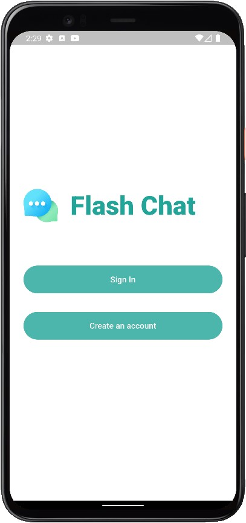
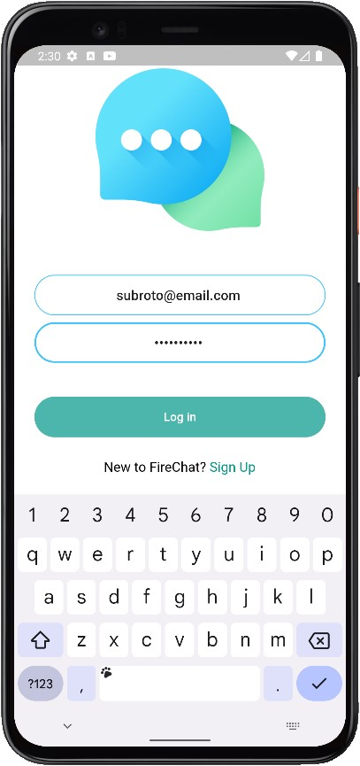
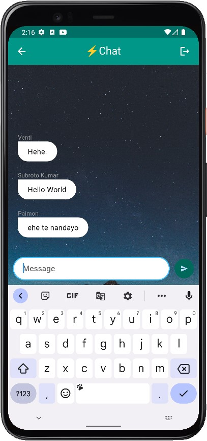

# FlashChat 
> Flutter Chat app for mobile devices.  

 

  

 

## Screenshot 

## Features

Flutter Chatting app for mobile that provides the instant communication functionality between users. The server is hosted on Firebase, which provides email login and
authentication for each user and is built with Cloud Firestore, which is a NoSQL-based database for storing data.
- Clean and Modern UI
- Instant Communication functionality between the users.
- Availbation for Android and iOS.

## Tech Stack

- **Programming Language:** Dart  
- **Framework:** Flutter
- **BaaS:** Firebase & Cloud Firebase 
- **Flutter Dependencies:**  
  - animated_text_kit  
  - firebase_core 
  - firebase_auth
  - cloud_firestore
  - modal_progress_hud_nsn

## Run Locally

1. Clone the project:  `git clone https://github.com/subrotokumar/flashchat.git`

2. Go to the project directory: `cd flashchat`

3. Install dependencies: `flutter pub get`

4. Start the server: `flutter run`

## Contribution
Your ideas, translations, design changes, code cleaning, or real heavy code changes or any help is always welcome. The more is contribution the better it gets

[Pull requests](https://github.com/cryptobook/pulls) will be reviewed
<!--
#### Known issues and limitations
-->